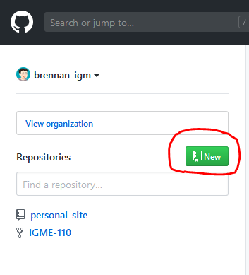
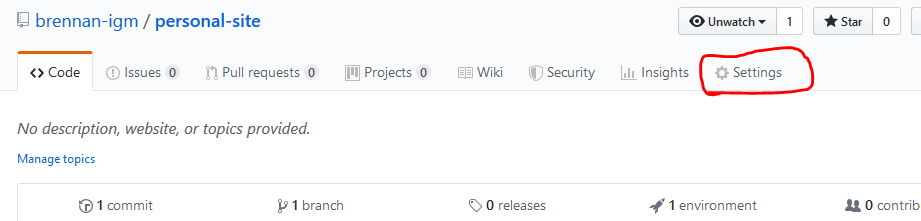

# Github Exercise

## Overview & Goals

In today's exercise, you'll upload your personal webpage to Github.

## Setting up your repository.

First we'll need to set up a repository on Github. If you don't already have a Github account, you'll have to make one first. 

When you log into Github, you'll have a list of your repositories on the left. Click the `New` button to create a new repository.

That will take you to a repository creation wizard. On this page you'll need to make a repository name, and  make sure it's set to public.

Once your respository is set up, you'll need to clone it using command line or using a git client. I'll go over how to do this using Sourcetree in class.

Once you've cloned your repository, you'll need to add your files to that repository. Unlike the last exercise, you don't want to have a www folder or a igme110 folder. You'll want the index.html file to be in the root folder of the repository.

Once you've added your files, make a commit of all the files, and push it to the `master` branch.

## Setting up GitHub pages

Now that your files are pushed to github, go to the settings page of your repository.

On the settings page, scroll down to the `GitHub pages` section of the options tab, and select the source for your page. You'll want to select the `master branch` option here.

And that's it! You're all set up now. If you scroll back down to that section, there'll be a link to your site.

## Due Date

Put a link to your GitHub pages site in the `Exercise - GitHub Setup` dropbox before the start of next class.